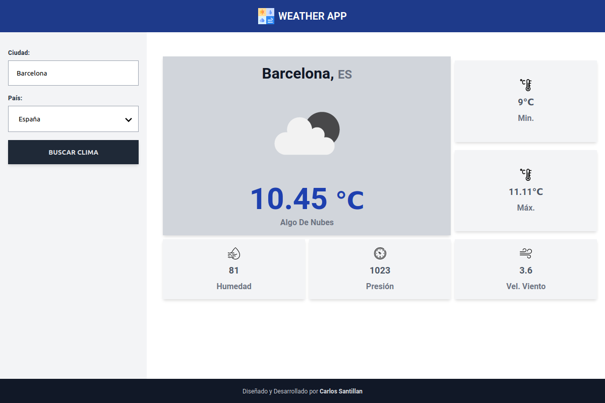

<h1 align="center">Buscador del Clima con React y TailwindCSS</h1>

<div align="center">
  <h3>
    <a href="https://clima-app-react-cse.netlify.app/">
      Demo
    </a>
    <span> | </span>
    <a href="https://github.com/carlossantesp/clima-app-react">
      Solución
    </a>
    <span>
  </h3>
</div>

## Tabla de contenido

- [Información](#información)
- [Desarrollado con](#desarrollado-con)
- [Instalación](#instalación)
- [Configuración](#configuracion)
- [Contacto](#contacto)

## Información



Aplicación que realiza busqueda del clima de una ciudad y país determinado, consumidos desde una API ([openweathermap](https://openweathermap.org/)), desarrollado con react, tailwincss y styled components

## Desarrollado con

- [React](https://es.reactjs.org/docs/getting-started.html)
- [Styled Components](https://styled-components.com/docs)
- [TailwindCSS](https://tailwindcss.com/docs)
- [Tailwind macro](https://www.npmjs.com/package/twin.macro?activeTab=readme)
- [API - Openweathermap](https://openweathermap.org/)

## Instalación

- Descargar el repositorio
  ```bash
  $ git clone https://github.com/carlossantesp/clima-app-react.git
  ```
- Instalar las dependecias

  **NPM**
  ```bash
  $ npm install
  ```

  **YARN**
  ```bash
  $ yarn install
  ```
- Ejecutar servidor de desarrollo

  **NPM**
  ```bash
  $ npm run start
  ```

  **YARN**
  ```bash
  $ yarn start
  ```
- Construir sitio web para el deploy

  **NPM**
  ```bash
  $ npm run build
  ```

  **YARN**
  ```bash
  $ yarn build
  ```
## Configuración

- Copiar el archivo `.env-example` y renombrarlo por `.env.development.local`

- Cambiar las variables de entornos

  ```bash
    REACT_APP_WEATHER_KEY=AQUI_TU_KEY_DE_OPENWEATHERMAP
    REACT_APP_WEATHER_URL=http://api.openweathermap.org
    REACT_APP_WEATHER_VERSION="2.5"
    REACT_APP_WEATHER_IMG_WIND=http://openweathermap.org/img/wn
  ```

> Nota.- Debe reiniciar el servidor de desarrollo para que se cargue la configuración de variables de entorno
## Contacto

- Portafolio web [carlos.santillan.dev](https://carlos.santillan.dev)
- GitHub [@carlossantesp](https://github.com/carlossantesp)
- Linkedin [@dev-santillan-carlos](https://www.linkedin.com/in/dev-santillan-carlos)
